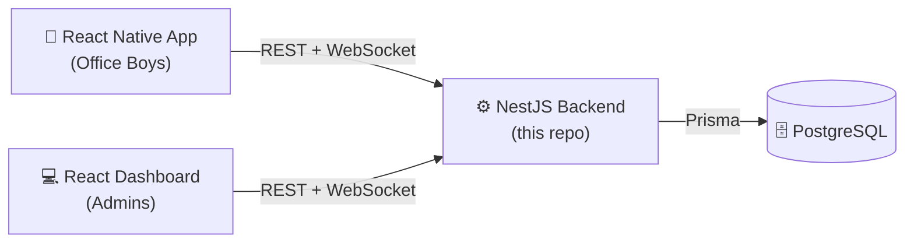
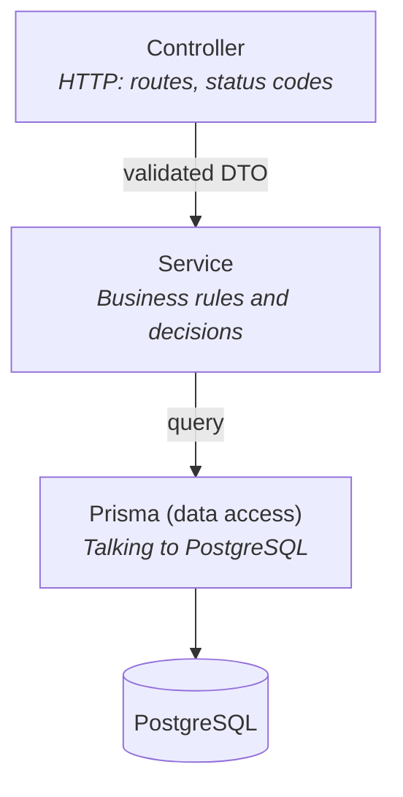
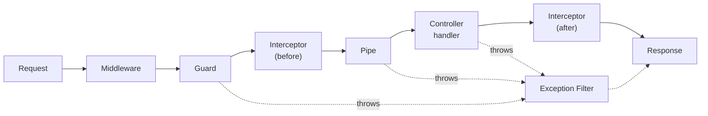
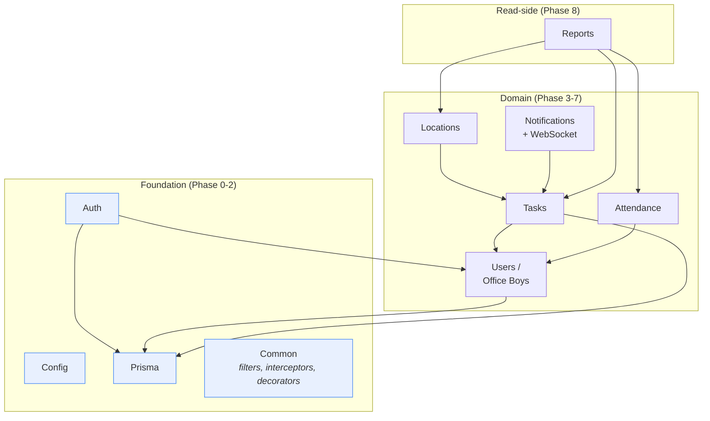
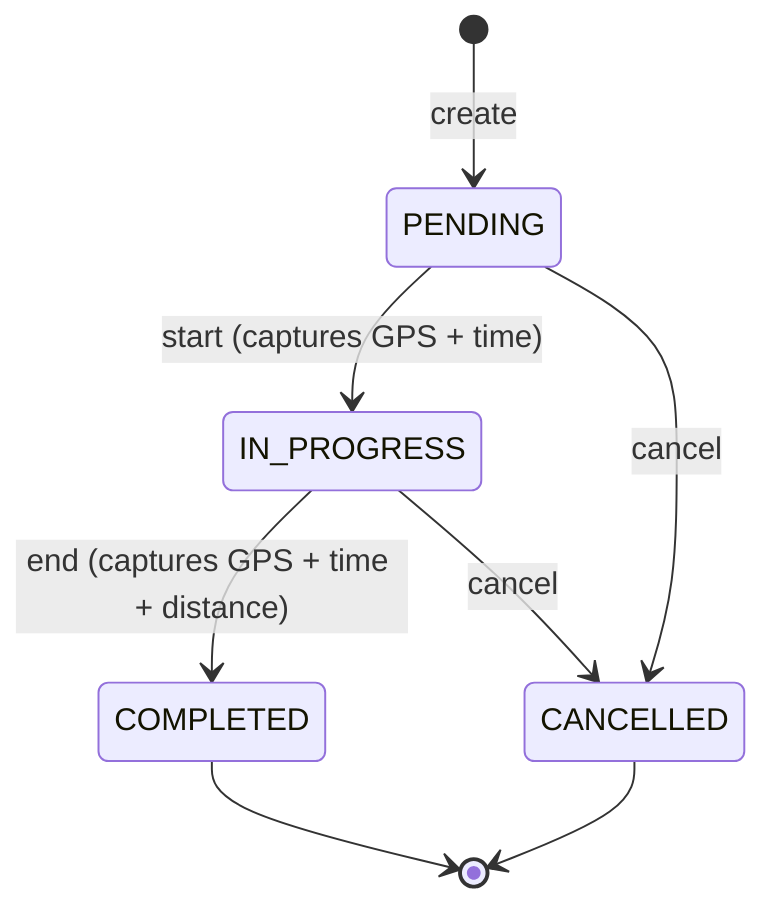
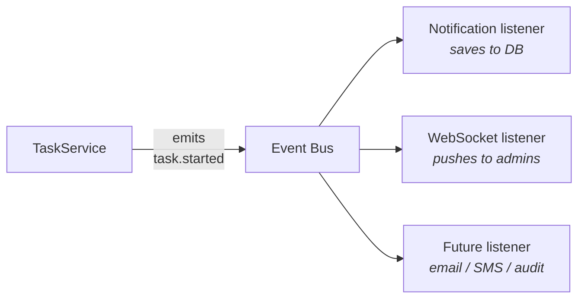

# OB Track — Backend Development Roadmap

> A step-by-step plan for building the OB Track backend, written to be **learned from**, not just followed.
> Every phase explains *what* we build, *why it comes at this point in the order*, and *what concepts you should walk away understanding*.

---

## How to read this document

- **Part 1** builds your mental model of the system. Read this first, even if it feels abstract. Everything later depends on it.
- **Part 2** explains the *ordering rules* — why the phases are sequenced the way they are. This is the most transferable knowledge in the whole document.
- **Part 3** is the actual phase-by-phase plan.
- **Part 4** lists the practices we repeat in every phase.
- **Part 5** is a status board we update as we go.

Do not skip Part 2. Knowing *why* step 4 comes after step 3 is worth more than knowing what step 4 is.

---

# Part 1 — The Architecture (your mental model)

## 1.1 The three-tier system

OB Track has three separate programs that talk over a network:

The backend is the **only** thing that touches the database. Neither app ever connects to PostgreSQL directly.

**Why does this matter?** Because it makes the backend the single place where rules live. "An office boy may only see their own tasks" is a rule. If both the mobile app and the dashboard enforced that rule themselves, you'd have two copies of it, and one day they'd disagree — and the disagreement would be a security hole. One backend, one set of rules.

> **Concept: the backend is the trust boundary.**
> Anything running on a user's phone or browser can be modified by that user. A determined office boy can edit the mobile app to send whatever they want. So the backend must **never trust input** and must re-check every rule itself. This is why we validate every request even though the app "already validated it."

## 1.2 Layered architecture inside NestJS

Inside the backend, code is organised in layers. Each layer has exactly one job, and only talks to the layer directly below it.

| Layer | Job | Should NOT do |
|---|---|---|
| **Controller** | Receive HTTP request, hand it to a service, return the result | Contain business rules, run database queries |
| **Service** | Make decisions: is this allowed? what should happen? | Know about HTTP (no `req`, `res`, no status codes) |
| **Prisma** | Read and write rows | Make decisions |

**Why bother separating them?** Three concrete payoffs:

1. **Testability.** A service with no HTTP knowledge can be tested by calling a plain function. No fake web server needed. (You already have this working — look at `auth.service.spec.ts`.)
2. **Reuse.** When we add WebSockets in Phase 6, the WebSocket gateway calls *the same service* the REST controller calls. If the rules were inside the controller, we'd have to copy them.
3. **Change isolation.** Switching from REST to GraphQL would mean rewriting controllers only. The rules stay untouched.

> **The rule to memorise:** *Controllers are thin. Services are thick.*
> If a controller method is more than ~3 lines, something belongs in a service.

## 1.3 The request lifecycle (the piece beginners always miss)

When a request arrives, NestJS runs it through a fixed pipeline before your controller ever sees it. Understanding this pipeline is how you stop writing repetitive code.

| Stage | Question it answers | Our use |
|---|---|---|
| **Middleware** | Raw request plumbing | helmet (security headers), compression, request logging |
| **Guard** | *May this request proceed?* | `JwtAuthGuard` (are you logged in?), `RolesGuard` (are you an admin?) |
| **Interceptor** | *Transform what goes in or comes out* | Wrapping responses in a consistent shape, timing slow requests |
| **Pipe** | *Is the input valid, and what type is it?* | `ValidationPipe` — turns raw JSON into a checked DTO |
| **Exception Filter** | *Something failed — what should the client see?* | One place that converts every error into a clean JSON error response |

> **Concept: cross-cutting concerns.**
> Logging, auth, validation, and error formatting apply to *every* endpoint. Code that applies everywhere should be written **once**, in the pipeline — not pasted into 40 controller methods. This is the single biggest reason NestJS looks more complicated than Express: it's giving you designated places to put the things that would otherwise be duplicated.

**Note the ordering trap:** Guards run *before* Pipes. So a guard cannot rely on the request body being validated yet. This catches people out.

## 1.4 The module dependency graph

A NestJS **module** is a folder that groups related things (controller + service + DTOs) and declares what it needs from others and what it offers.

Here is what we are building. Arrows mean "depends on":

**Read the arrows and the build order falls out of it.** `Locations` points at `Tasks`, so Tasks must exist first. `Reports` points at almost everything, so it goes last. This graph *is* the roadmap.

---

# Part 2 — Why this order? (the transferable part)

We order the work by four rules, applied in priority order.

### Rule 1 — Build what others depend on, first

You cannot write a `POST /tasks/:id/locations` endpoint before tasks exist. Dependencies force order. This is obvious.

### Rule 2 — Decide expensive-to-change things early

Not all decisions cost the same to reverse.

| Decision | Cost to change later |
|---|---|
| Variable name in a service | Seconds |
| Adding an endpoint | Minutes |
| Changing an error response shape | Hours — every client breaks |
| **Changing the database schema** | **Days — plus data migration on live data** |
| **Changing the auth model** | **Days — every endpoint's security assumptions shift** |

So: **schema and auth get settled before we build features on top of them.** Right now your database is empty and only two modules exist. Changing the schema today costs an afternoon. Changing it after Tasks, Locations, Attendance, and Reports are built — with real office boys' data in production — costs a week and risks data loss.

> **Concept: reversibility.** Senior engineers don't try to get everything right. They identify which decisions are hard to undo and spend their thinking budget *there*, while moving fast on everything else.

### Rule 3 — Cross-cutting concerns go in before the code they cut across

Error handling, logging, validation, and Swagger apply to every module. Suppose we build eight modules first and add a global exception filter afterwards. We'd then have to revisit all eight to remove their ad-hoc `try/catch` blocks and inconsistent error shapes.

Doing it first means every module written afterwards **inherits it for free**. This is why Phase 0 looks unglamorous — no features at all — and is still the highest-value phase in the plan.

### Rule 4 — Attack the riskiest unknown early

There's one genuinely hard problem hiding in this project, and it is **not** authentication or CRUD. It's this:

> GPS data from a phone is noisy, arrives out of order, arrives late (offline sync), and arrives twice (retries). Naively adding up the distance between consecutive points **overstates real distance by 30–50%**, because a stationary phone still reports coordinates that jitter by several metres.

If office boys' distance reports are wrong, the entire product is worthless. So Phase 5 gets real design attention rather than being treated as "just save the coordinates."

> **Concept: risk-first development.** The scariest part of a project should be tackled while you still have time to change course — not in the final week.

### Why *not* other orders?

- **"Build all the CRUD first, secure it later."** Very common, very bad. Security added last is security bolted on: you discover the guard needs data the token doesn't carry, and you refactor everything. Also, un-secured endpoints have a habit of reaching production.
- **"Build the reports first, they're what the client wants to see."** Reports aggregate data that doesn't exist yet. You'd be writing queries against empty tables with no way to verify they're right.
- **"Write all the tests at the end."** Tests written at the end test what the code *does*, not what it *should* do — they lock in your bugs. We test alongside.

---

# Part 3 — The Phases

Each phase below is a working, committable increment. Nothing is left half-finished between phases.

---

## Phase 0 — Foundations & cross-cutting concerns

**Estimated: 1–2 sessions | Depends on: nothing**

### What we build

| Item | Purpose |
|---|---|
| Environment config with schema validation | App refuses to start if `DATABASE_URL` or `JWT_SECRET` is missing or malformed |
| `strict: true` in TypeScript | The compiler catches whole categories of bugs before you run anything |
| Fixed build output path | `npm run start:prod` currently points at a file that isn't there |
| Hardened `main.ts` | helmet, compression, CORS, API versioning, graceful shutdown |
| Global exception filter | Every error — expected or not — becomes a consistent JSON response |
| Response interceptor | Every success becomes a consistent JSON envelope |
| Structured logging | Logs as searchable JSON with a request id, not `console.log` |
| Swagger / OpenAPI | Auto-generated, always-current API docs at `/api/docs` |
| Health check endpoint | So a deployment platform can tell if the app is alive |
| `.env.example` | So a new developer knows which variables to set |

### Why this comes first

Every one of these applies to **every endpoint we will ever write**. Written now, all future code inherits them. Written later, all past code must be revisited.

The config validation deserves a special note. There are two ways an app can handle a missing `JWT_SECRET`:

- **Fail lazily** — start fine, then crash at 2am when the first user logs in. ← where you are now
- **Fail fast** — refuse to start, with the message `JWT_SECRET is required`. ← where we're going

Fail-fast turns a production incident into a deployment that simply doesn't happen.

### Concepts you'll learn

- **12-factor config** — configuration lives in the environment, never in code. The same build artifact runs in dev, staging, and production; only the environment differs.
- **Fail-fast** — surface problems at the earliest possible moment.
- **The NestJS request pipeline** (§1.3) — you'll actually implement pieces of it here.
- **API contracts** — a consistent response shape is a promise to client developers. Breaking it breaks their apps.
- **Observability** — you can't fix what you can't see. Structured logs and a request-correlation id are how you debug production.

---

## Phase 1 — Database schema, round two

**Estimated: 1 session | Depends on: nothing (but must precede all feature work)**

### What we build

A revised `schema.prisma` plus one migration, and a seed script.

Additions and corrections to the current schema:

| Change | Reason |
|---|---|
| New `Attendance` model | Required by spec, currently missing |
| New `Route` model | Stores the computed path + cached distance so reports don't recompute it every time |
| `clientId` unique key on `Task` and `TaskLocation` | **Offline sync idempotency** — see below |
| Split `recordedAt` (device) / `receivedAt` (server) | With offline sync these can differ by hours |
| `onDelete: Cascade` on child relations | Deleting a task shouldn't be blocked by its own location rows |
| Composite indexes | `[officeBoyId, status]`, `[officeBoyId, createdAt]`, `[taskId, recordedAt]` — the queries reports will run |
| Drop redundant `@@index([email])` | `@unique` already creates an index; the extra one costs writes and buys nothing |
| Rename `distance` → `distanceMeters`, `duration` → `durationSeconds` | Units in the name prevent an entire class of bug |
| Extra GPS fields: `speed`, `altitude`, `heading`, `isMoving`, `batteryLevel` | Needed to filter noise (Phase 5) and to debug tracking problems |
| `seed.ts` | Creates the first admin, so we can lock down `POST /users` |

### Why this comes before features and after Phase 0

**Before features**, because of Rule 2 (reversibility). The database is the foundation of the building. You can repaint walls cheaply; you cannot move the foundation cheaply. Right now the DB is empty — this is the last moment where a schema change is free.

**After Phase 0** only because Phase 0 is faster and unblocks everything else too; the two are largely independent.

### The idempotency problem — worth understanding deeply

The mobile app works offline. It stores GPS points on the phone, then uploads them when the network returns. Now consider this sequence:

1. Phone uploads 50 points.
2. Server saves all 50 successfully.
3. The response is lost — the tunnel, the lift, the dead battery.
4. Phone sees no response, assumes failure, **uploads the same 50 points again**.
5. Server saves 50 more rows.

Result: 100 rows for 50 real positions, and a distance report showing roughly double the truth. The office boy looks like they walked 12km instead of 6km.

The fix is an **idempotency key**: the phone generates a unique id for each point (a UUID) at capture time and sends it. The server does an `upsert` on that id — "insert if new, ignore if I already have it." Now retrying is harmless.

> **Concept: idempotency.** An operation is idempotent if doing it twice has the same effect as doing it once. Over unreliable networks, retries are not an edge case — they are guaranteed. Any endpoint that a client might retry must be idempotent, and that property has to be designed into the schema, not patched on later. This is the main reason we're revising the schema before writing the sync endpoint.

### Concepts you'll learn

- **Migrations as immutable history** — never edit a migration that has already run somewhere. Add a new one.
- **Indexes** — why `WHERE officeBoyId = ? AND status = ?` needs a *composite* index, and why every index makes writes slower (so more is not better).
- **Referential actions** (`Cascade` / `Restrict` / `SetNull`) — what the database does to children when a parent is deleted.
- **Idempotency** — as above.
- **Naming as documentation** — `distanceMeters` cannot be misread. `distance` can.

---

## Phase 2 — Securing authentication

**Estimated: 1–2 sessions | Depends on: Phase 0 (config), Phase 1 (seed for first admin)**

### What we build

| Fix | Problem it solves |
|---|---|
| Guard `POST /users` with admin-only RBAC | Currently **anyone on the internet can create an admin account** |
| Refresh token rotation + reuse detection | A stolen token currently stays valid for 7 days even after the victim refreshes |
| Token lookup by id instead of scanning | Current code runs a bcrypt comparison against *every* stored token for that user — it gets permanently slower with each login |
| Per-device sessions | Logging out on the phone currently logs you out of the dashboard too |
| `isActive` enforced at login *and* in the JWT strategy | Deactivating an account currently does nothing at all |
| Rate limiting on auth endpoints | The login endpoint is an unlimited password-guessing oracle |
| Password strength rules | |

### Why this comes here — not earlier, not later

**Not earlier:** we need Phase 1's seed script first. There's a chicken-and-egg problem — the reason `POST /users` is open is that it's the only way to create the first admin. Lock it before seeding exists and you lock yourself out.

**Not later:** every endpoint from Phase 3 onward sits behind these guards. The guard defines a contract — "by the time your controller runs, `req.user` exists and has this shape." Change that contract after twelve controllers depend on it and you edit twelve controllers.

### Concepts you'll learn

- **Authentication vs authorisation.** Authentication = *who are you* (login, JWT). Authorisation = *what may you do* (RBAC, ownership checks). Different problems, different code, commonly confused.
- **Why JWTs are stateless, and what that costs.** The server doesn't store access tokens, so it can't revoke one. That's the trade: scalability in exchange for a window where a stolen token still works. We manage the trade by keeping access tokens short-lived (15 min) and putting the revocable state in refresh tokens.
- **Token rotation and reuse detection.** Each refresh issues a new refresh token and invalidates the old one. If an *already-used* token ever comes back, that means two parties hold it — a theft signal. We kill the whole session.
- **Defence in depth.** Rate limiting doesn't make passwords stronger, and strong passwords don't stop credential stuffing. You want both. No single control is sufficient.
- **Ownership checks.** RBAC says "office boys may view tasks." It does *not* say "office boy A may view office boy B's tasks." Role checks and ownership checks are separate, and forgetting the second is one of the most common real-world API vulnerabilities.

---

## Phase 3 — Users & Office Boy management

**Estimated: 1–2 sessions | Depends on: Phase 2**

### What we build

Admin-facing: list office boys (paginated, searchable, filterable), view one, create, update profile, activate/deactivate, reset password.
Self-facing: view own profile, update own profile, change own password.

### Why here

Tasks belong to office boys. You cannot meaningfully create or test a task without a user to assign it to. Rule 1.

This phase is also where we establish the **CRUD patterns** every later module copies: how we paginate, how we filter, how we shape responses, how we separate create-DTO from update-DTO from response-DTO. Getting the pattern right once means Tasks, Attendance, and Notifications are much faster to write.

### Concepts you'll learn

- **DTO layering.** Three different shapes for one concept: `CreateUserDto` (what you may send when creating), `UpdateUserDto` (what you may change — note `email` and `role` probably shouldn't be in here), `UserResponseDto` (what we return — **never** includes `password`). Beginners use one class for all three and leak data.
- **Never return the database model directly.** Add a `deletedReason` column for internal use and — if you return the raw model — you have just published it in your API. Explicit response mapping prevents accidental exposure.
- **Pagination.** Why `?page=2&limit=20` (offset) is simple but drifts when rows are inserted mid-scroll, and when cursor pagination is the better tool.
- **Soft delete.** Deleting an office boy who has 400 historical tasks would either fail or destroy history. Deactivation, not deletion, is nearly always the right answer for people.
- **Idempotent updates and partial updates** — `PATCH` semantics.

---

## Phase 4 — Task lifecycle

**Estimated: 2 sessions | Depends on: Phase 3**

### What we build

Create task, start task, end task, cancel task, list/filter tasks, task detail — with the status lifecycle **enforced in code**.

### Why here

It's the heart of the domain, it needs users (Phase 3), and Locations, Notifications and Reports all need it.

### The big idea in this phase: state machines

Look at the diagram and note what is **absent**. There is no arrow from `COMPLETED` back to `IN_PROGRESS`. None from `CANCELLED` to anything.

A naive implementation exposes `PATCH /tasks/:id { status }` and lets the client set any value. That allows: completing a task that never started (so `startTime` is null and duration calculation crashes), re-completing a finished task (overwriting the real end time), un-cancelling. Each becomes a support ticket and a corrupt row.

Instead we expose **verbs, not fields**: `POST /tasks/:id/start`, `POST /tasks/:id/end`. Each checks the current state and refuses invalid transitions with `409 Conflict`.

> **Concept: make invalid states unrepresentable.** The best bug is one the code makes impossible, not one you remember to check for. Modelling operations as transitions rather than field assignments is how you get there.

Second idea: **transactions**. Ending a task means: update status, set `endTime`, compute and store distance, create a notification. If the process dies halfway, you get a task marked complete with no end time. A transaction makes all of it happen or none of it.

> **Concept: atomicity.** A unit of work that must not be half-done goes in a transaction. Ask yourself of every multi-write operation: "if the server loses power right here, is the data still sensible?"

### Concepts you'll learn

- State machines and invalid-state prevention
- Database transactions and atomicity
- **Race conditions** — two "start" requests arriving simultaneously; what optimistic concurrency control does about it
- REST design: when to use a sub-resource verb (`/tasks/:id/start`) instead of a field update
- Correct HTTP status codes — `409 Conflict` for "valid request, wrong state" vs `400` for "malformed request" vs `422`

---

## Phase 5 — Location tracking & offline sync ⚠️ *hardest phase*

**Estimated: 2–3 sessions | Depends on: Phases 1 and 4**

### What we build

- `POST /tasks/:id/locations/batch` — accepts an array of points, idempotent, partial-success aware
- GPS noise filtering pipeline
- Distance calculation (Haversine)
- Route storage and retrieval

### Why here

Locations belong to tasks (Rule 1), and the idempotency keys they need landed in Phase 1.

### Why this is the hard one

**Problem 1: GPS jitter.** A phone sitting still on a desk reports positions that wander by 3–10 metres. Sum the distance between consecutive readings over an 8-hour shift and a motionless phone "travels" several kilometres. Naive implementations routinely overstate distance by 30–50%.

Our filtering pipeline, applied in order:
1. **Accuracy gate** — discard points whose reported accuracy is worse than ~50m.
2. **Minimum displacement** — ignore movement below roughly the accuracy radius; it's noise, not motion.
3. **Speed sanity** — a point implying 300 km/h is a GPS glitch, not a fast office boy.
4. **Time gate** — don't compute over points less than a few seconds apart.

**Problem 2: out-of-order arrival.** Offline batches can arrive after newer live points. So we sort by device `recordedAt` before computing anything, and never assume insertion order.

**Problem 3: batch partial failure.** 50 points arrive, point 37 is malformed. Reject all 50 and a valid 49 are lost forever. Accept silently and you hide a client bug. We return per-item results — `202` with an accepted/rejected breakdown.

### Concepts you'll learn

- **Haversine formula** — great-circle distance on a sphere, and why simple Pythagoras on lat/lng is wrong (degrees of longitude shrink as you move away from the equator).
- **Signal filtering** — real sensor data is dirty. Assume it.
- **Batch API design** — throughput, and what "partial success" means in HTTP.
- **Derived data: compute vs store.** Recomputing distance on every report request is correct but slow; caching it on the task is fast but can go stale. When to pick which.
- **Clock skew** — device time can be wrong or deliberately changed. Never trust a client timestamp for anything security-relevant; keep a server-side `receivedAt` too.

---

## Phase 6 — Attendance

**Estimated: 1 session | Depends on: Phase 3**

Check-in / check-out with location and time, daily records, late/absent derivation.

**Why here:** it only needs users, so it *could* have come earlier. It's placed after Tasks because Tasks is on the critical path — Locations, Notifications and Reports all wait on it, while nothing waits on Attendance. When ordering work, prioritise what unblocks the most other work.

> **Concept: the critical path.** In any plan with dependencies, some tasks block many others and some block none. Do the blocking ones first, even if the others feel more urgent.

**Concepts:** business rules as data (grace periods, shift times belong in config, not hardcoded); date-only vs timestamp columns; the unique constraint that stops double check-ins.

---

## Phase 7 — Notifications & WebSockets

**Estimated: 1–2 sessions | Depends on: Phase 4**

### What we build

Persisted notifications (list, mark read, unread count) plus a Socket.IO gateway pushing live task events to admins.

### The design decision that matters

The naive approach: inside `TaskService.startTask()`, call `notificationService.notify()` and `websocketGateway.emit()`.

The problem: `TaskService` now depends on notifications *and* WebSockets. Testing task-starting requires mocking both. Adding email alerts later means editing `TaskService` again. Task logic slowly accumulates every side effect in the system.

The better approach — **events**:

`TaskService` announces *what happened* and knows nothing about who cares. New reactions are new listeners — `TaskService` is never touched again.

> **Concept: coupling.** Coupling is how much one piece of code must know about another. Low coupling means changes stay local. Events are one of the cleanest ways to decouple "something happened" from "here's what we do about it."

### Concepts you'll learn

- Event-driven architecture; publisher/subscriber
- **WebSocket authentication** — sockets are long-lived, so auth happens once at handshake rather than per request. A common vulnerability is forgetting to authenticate the handshake at all.
- **Rooms** — admins join an `admins` room; each office boy joins their own. You emit to a room instead of filtering on the client (never send data to a client and rely on it to hide it).
- **Persist *and* push.** A push reaches only connected clients. If it isn't also saved, anyone offline never learns about it.

---

## Phase 8 — Reports & analytics

**Estimated: 2 sessions | Depends on: Phases 4, 5, 6**

Daily/weekly/monthly aggregates, distance and completion reports, per-office-boy performance, dashboard KPIs, CSV export.

**Why last:** reports read everything above. Building them earlier means writing queries against empty tables with no way to know if they're right.

### Concepts you'll learn

- **Read vs write workloads.** Writes touch one row and must be correct instantly. Reports scan thousands of rows and can tolerate being a minute stale. Different problems — different indexes, different caching, sometimes different databases entirely.
- **`groupBy`, aggregations, and when to drop to raw SQL.** Prisma covers most cases; complex time-bucketing is often cleaner as raw SQL.
- **Timezones — the classic production bug.** "Today's report" for a user in UTC+5 covers a different window than for the server in UTC. Store UTC always; convert only at the edges; require the client to state its timezone.
- **N+1 queries** — fetching 50 tasks then querying each one's locations separately is 51 queries. Learn to spot it and fix it with `include`.
- **Caching and invalidation** — when a cached KPI is acceptable, and how it goes wrong.

---

## Phase 9 — Testing & quality hardening

**Estimated: 1–2 sessions | runs *throughout*, consolidated here**

We write tests *during* every phase. This phase fills gaps: end-to-end tests against a real test database, coverage thresholds, and CI.

> **Concept: the testing pyramid.** Many fast unit tests (services in isolation), fewer integration tests (module + real database), fewest end-to-end tests (full HTTP round trip). Inverting it gives you a slow, flaky suite nobody trusts — and a suite nobody trusts is worse than no suite, because it teaches the team to ignore red builds.

Also: tests written *after* the code tend to assert what the code currently does, bugs included. Writing them alongside forces you to state what it *should* do.

---

## Phase 10 — Deployment

**Estimated: 1–2 sessions | Depends on: all**

Multi-stage Dockerfile, docker-compose for local Postgres, migration strategy for deploys, secrets handling, graceful shutdown, monitoring hooks, deployment runbook.

### Concepts you'll learn

- **Multi-stage Docker builds** — build with the full toolchain, ship only the runtime. Smaller image, smaller attack surface.
- **`migrate deploy` vs `migrate dev`** — never run the interactive, schema-drifting one against production.
- **Graceful shutdown** — on deploy, stop accepting new requests, finish in-flight ones, close the DB pool, then exit. Otherwise every deploy drops live requests.
- **Secrets management** — why `.env` files are for development and a secret manager is for production.
- **Zero-downtime migration rules** — additive changes first, backfill, then remove old columns in a *later* deploy. Renaming a column in one shot breaks every running instance of the old code.

---

# Part 4 — Practices we follow in every phase

These aren't a phase; they're the standard applied throughout.

1. **Validate every input.** Every request body gets a DTO with `class-validator` decorators. No exceptions.
2. **Never return raw database models.** Always map to an explicit response shape.
3. **Never log secrets.** No passwords, no tokens, no full request bodies on auth routes.
4. **Every endpoint documented in Swagger** as it is written, not afterwards.
5. **Every service method has a unit test** covering the happy path and the main failure.
6. **Thin controllers, thick services.**
7. **Correct HTTP status codes.** `200/201/204` · `400` malformed · `401` not logged in · `403` logged in but not allowed · `404` not found · `409` wrong state · `422` semantically invalid · `429` rate limited.
8. **Errors are typed.** Throw `NotFoundException`, not `new Error('not found')`.
9. **Small commits with clear messages.** One logical change each.
10. **No magic numbers.** `900` is meaningless; `ACCESS_TOKEN_TTL_SECONDS` is not.

---

# Part 5 — Status board

| Phase | Scope | Status |
|---|---|---|
| 0 | Foundations & cross-cutting concerns | ✅ **Complete** — see `docs/PHASE-0.md` |
| 1 | Database schema round two + seed | ✅ **Complete** — see `docs/PHASE-1.md` |
| 2 | Auth hardening & RBAC | ✅ **Complete** — see `docs/PHASE-2.md` |
| 3 | Users & office boy management | ✅ **Complete** — CRUD, list/search, activate/deactivate, admin password reset (all admin-guarded; deactivate & reset revoke refresh tokens) |
| 4 | Task lifecycle | ✅ **Complete** — create/start/complete/cancel, settlement (amounts + receipt + submit), admin views, per-OB & admin stats |
| 5 | Location tracking & offline sync | ✅ **Complete** — batch locations, route computation, distance/duration |
| 6 | Attendance | ⬜ Not started — schema only, no module |
| 7 | Notifications & WebSockets | ⬜ Not started |
| 8 | Reports & analytics | ✅ **Complete** — admin & per-office-boy statistics, effective-dated reimbursements, Hours Saved with collective totals, petty cash receipts feed, four xlsx exports |
| 9 | Testing & quality hardening | 🟨 Partial — 216 unit tests passing, no e2e harness |
| 10 | Deployment | ✅ **Complete** — Dockerfile, docker-compose (Postgres + api + nginx + migrate), `deploy.sh`, `nginx/`, `docs/DEPLOYMENT.md` |

### Delivered in the settlement & reporting pass

The product spec's tail — the part beyond "the errand happened" — is now built:

- **Task flow completed.** `create → start → track → end → settlement → receipt →
  submit`, one route per step. The settlement is the two amounts
  (`Decimal(12,2)`, defaulting to 0) plus free-text `vendorDetails` — who the
  money was spent with — and is written **only** by
  `PATCH /tasks/:id/settlement`. `/end` deliberately refuses those fields,
  because two writers with different meanings for an omitted field let a
  settlement screen that saves on mount silently wipe what was just stored. The
  receipt is optional; `submittedAt` freezes the record for the admin.
- **Receipt storage** behind a `StorageService` abstraction (`src/storage/`).
  Local disk today; swapping to object storage is one `useClass` change. File
  types are verified from magic bytes, and storage keys are server-generated so a
  filename can never become a path.
- **Reimbursement rate as effective-dated history** (`src/reimbursement/`),
  admin-settable via `POST /admin/reimbursement-rates`. A task is priced at the
  rate in force when it ended, so a rate change never restates a closed month.
  Replaces the hardcoded `REIMBURSEMENT_RATE_PER_KM = 25`.
- **Top 10 cap enforced** — at most ten active employees, checked on create *and*
  activate inside a serializable transaction. `DELETE /employees/:id` removes an
  unused employee and refuses (409) one with history.
- **Hours Saved** gained collective totals, a date window, per-employee detail,
  and an xlsx export.

### What already exists and is worth keeping

- Prisma 7 with the `@prisma/adapter-pg` driver adapter, correctly configured
- Global `PrismaModule`, migrations consistent with the schema (no drift)
- JWT access + refresh login flow, refresh tokens stored hashed
- `RolesGuard` and `@Roles()` decorator applied across users/tasks/employees/admin
- Global `ValidationPipe` with `whitelist` + `forbidNonWhitelisted` — the correct strict setting
- Shared helpers rather than copies: `buildTaskWhere`, `buildPaginationMeta`,
  `parseBoolean`, `ExcelExportService`, `decimalToNumber`

---

## Working agreement

For each phase, in order:

1. **Explain** — what we're building and why, before any code.
2. **Build** — production-ready implementation, small reviewable steps.
3. **Walk through** — each important file, function, and decision, in plain language.
4. **Summarise** — what was done, why, how it works, and the concepts to take away.
5. **Verify** — build passes, tests pass, endpoints exercised.

Ask questions at any point. "Why did you do it that way?" is the most valuable question in software, and there should always be a real answer — if there isn't, the code is probably wrong.
